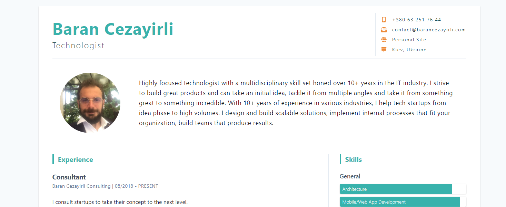

# Gatsby Starter Resume CMS




Gatsby Starter Resume CMS is a free starter template with  Netlify CMS as headless CMS. It is easy to customize the design with thanks to tailwind theming capabilities. It uses git as a backend and can be deployed to any static hosting service like Netlify, firebase hosting or Github pages.

[Demo](https://gatsby-resume-starter.netlify.com/)

[Customization and Theming](https://barancezayirli.com/free-gatsby-resume-starter-with-netlify-cms/#customization)

## Features

- One-page resume/CV
- PWA
- Multiple Netlify CMS widgets
- Netlify CMS as Headless CMS
- Tailwind for styling with theming
- Optimized build process
- Basic SEO, site metadata
- Prettier
- Social media links

## Quick Start

### Create a Gatsby site

Use the Gatsby CLI to create a new site, specifying the resume starter.

```shell
# create a new Gatsby site using the blog starter
gatsby new my-resume https://github.com/barancezayirli/gatsby-starter-resume-cms
```

### Start developing

Navigate into your new site’s directory and start it up.

```shell
cd my-resume/
gatsby develop
```

## Updating Content

The resume content is generated from `data/profile.json` file. You can manually edit this file or setup Netlify CMS for online editing.

You can find more information on resume widgets and theming [here](https://barancezayirli.com/free-gatsby-resume-starter-with-netlify-cms/#customization).

### Netlify CMS as Headless CMS

To use Netlify CMS  you’ll need to deploy to Netlify through GitHub, Gitlab or Bitbucket, set up continuous deployment, and do a few configuration. For Github:

Open `static/admin/config.yml`. Replace `barancezayirli/gatsby-resume-tailwind` with your GitHub username and project name. This step is important for managing and deploying the Netlify CMS interface.

```yaml
backend:
  name: github
  repo: barancezayirli/gatsby-resume-tailwind #TODO replace this with your own repo
```

Publish your repo to Github, then, open [Netlify](app.netlify.com) and add a “New site from Git”. Choose your newly created repo and click on “Deploy site” with the default deployment settings.

Finally need to set up an OAuth application on GitHub. Start development build with `gatsby develop` and visit `http://localhost:8000/admin` and authorize Netlify to make commits for you.

If it doesn't work, the instructions for setting up OAuth can be found here: [Netlify’s Using an Authorization Provider](https://www.netlify.com/docs/authentication-providers/#using-an-authentication-provider).

I hope you enjoy the resume template, if you do please follow me on [twitter](https://twitter.com/barancezayirli) and send me your results.
I would love to see it!
